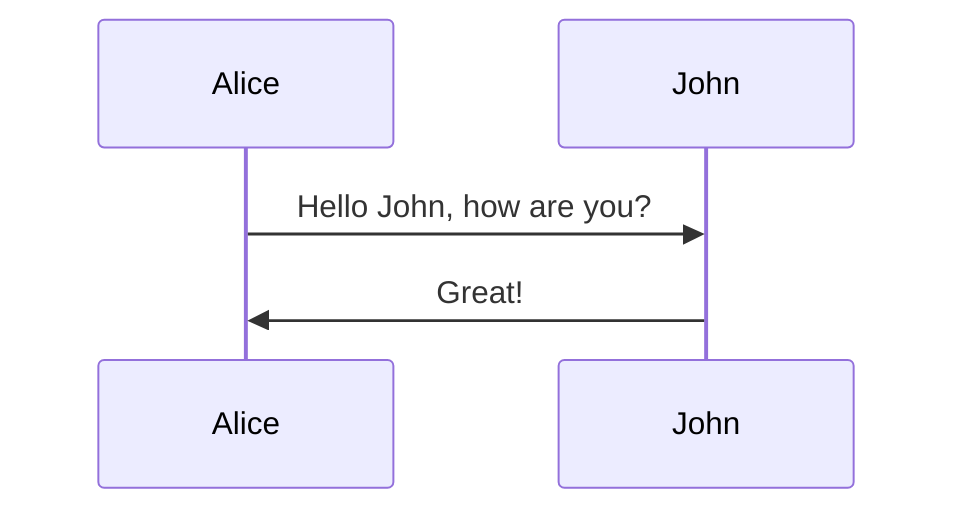
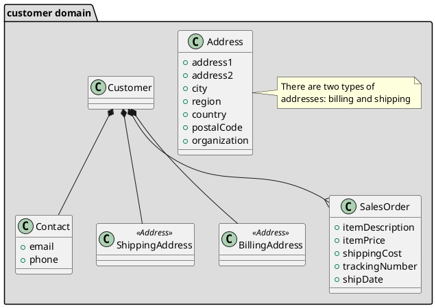

# CONTROL DE CADUCIDADES

El programa de control de caducidades permite dar de alta
artículos con diferentes características, entre ellas,
un stock asociado a un lote y una fecha, y una fecha de caducidad.

Se realizarán recuentos diarios de las unidades en stock
de cada producto y se registrarán en una base de datos.

El programa permite consultar y manejar las unidades próximas a la 
caducidad registrada, así como las unidades caducadas.

## Requisitos

El programa debe incluir programación de objetos, bases de datos,
librerías y la utilización de un framework

## Objetivo

El objetivo de este proyecto es superar el proyecto de fin de curso
para obtener el título "Programación Pyhton"

## Diseno

#Probando UML

### uml: class diagram

## Construido con

-Python

-Framwork (definir)

-SQLite
